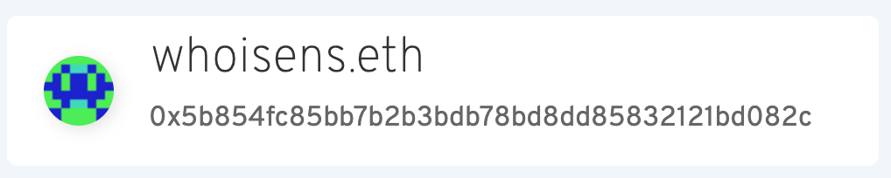
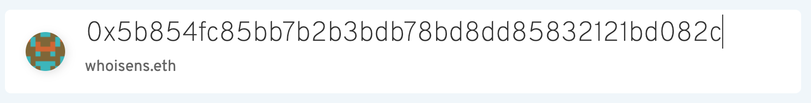

# Ethereum Address component





Please refer to `src/routes/Test.js` for examples.

Demo: http://localhost:3000/Test
E2E test: `cypress/integration/address.spec.js`

### Basic usage

```
<AddressInput provider={web3.currentProvider} />
```

#### Parameters:

- provider - Web3 provider **(required)**
- placeholder - set custom placeholder. Default: 'Enter Ethereum name or address'
- showBlockies - show digital image based on address (similar to github). Default: true
- showSearchIcon - search icon on the left. Only present when nothing is typed. Default: true
- onError - callback. Invokes every time error is happened or invalid name is typed. When typed name is corrected, invokes with null after error.
- onSuccess - callback. The same as onError callback, but invokes when address or name resolved.
- className - any custom class for styling. Already implemented `small` class renders component in small size


#### Styling

All styling made in `style.css`. It can be take as a start point.
`.cmp-address` - reserved class for that component.
`.cmp-address.small` - for small type of component. Overriding other classes under that parent you can safety style a component.
